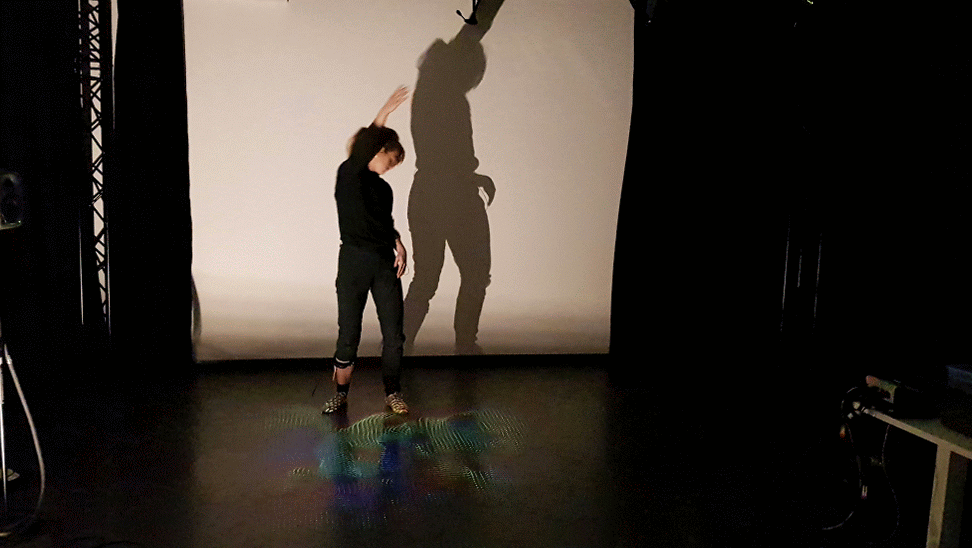

# FloorTrails

A Processing sketch that uses optical flow to create trails. It has been optimised for projecting on the floor, and using a web camera hanging in the ceiling.

## Features ##

- Set up for using a Logitech web camera. Needs to change to other input devices on line 80.
- Can use keyboard shortcuts 1, 2, 3 to change between different settings.

## Showcase

## Performances

The sketch was used in the third part of the interactive dance performance Vrengt at:

* [MusicLab vol. 3](https://www.hf.uio.no/ritmo/english/news-and-events/events/musiclab/2018/rhythm/index.html) at University of Oslo, 15 November 2018.

* NIME 2019, Porto Alegre, Brazil, 4 June 2019.

## Credits

The sketch is based on PixelFlow by [Thomas Diewald](http://thomasdiewald.com)
